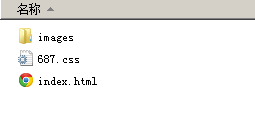

## special 专题页

src 开发环境

dist 生产环境

## install

`npm install --save-dev gulp gulp-browserify gulp-concat gulp-connect gulp-react lodash reactify gulp-sass gulp-jshint gulp-autoprefixer gulp-livereload  gulp-minify-css gulp-uglify gulp-rename browser-sync gulp-notify gulp-zip

## Demo

[demo](http://panli-com.github.io/special)

专题页目录结构如下
`
